# Table of Contents
- [**Setting up, getting started**](#setting-up-getting-started)
- [**Design**](#design)
  * [Architecture](#architecture)
  * [UI component](#ui-component)
  * [Logic component](#logic-component)
  * [Model component](#model-component)
  * [Storage component](#storage-component)
  * [Common classes](#common-classes)
- [**Implementation**](#implementation)
  * [Add person](#add-person)
  * [Add location](#add-location)
  * [Add visit](#add-visit)
  * [Manage Persons, Locations and Visits using Unique Identifiers (Ho Pin Xian)](#manage-persons-locations-and-visits-using-unique-identifiers-ho-pin-xian)
    + [Adding Visit using Unique Identifiers](#adding-visit-using-unique-identifiers)
    + [Sequence diagram](#sequence-diagram)
    + [Activity diagram](#activity-diagram)
    + [Design consideration](#design-consideration)
      - [Aspect: User Input Identifiers Vs VirusTracker Created Identifiers](#aspect-user-input-identifiers-vs-virustracker-created-identifiers)
  * [Deleting Visit using a specific Index (Shu long)](#deleting-visit-using-a-specific-index-shu-long)
    + [Implementation](#implementation)
    + [Sequence diagram](#sequence-diagram-1)
    + [Design consideration](#design-consideration-1)
  * [Deleting Visits using a specific date (Shu long)](#deleting-visits-using-a-specific-date-shu-long)
    + [Implementation](#implementation-1)
    + [Sequence diagram](#sequence-diagram-2)
    + [Design consideration](#design-consideration-2)
      - [Aspect: Deleting visits using person and location vs using date](#aspect-deleting-visits-using-person-and-location-vs-using-date)
        
      

      
  * [Manage data using CSV files (Siang Ern)](#manage-data-using-csv-files-siang-ern)
    + [Importing data from a CSV file](#importing-data-from-a-csv-file)
    + [Sequence diagram](#sequence-diagram-3)
    + [Design consideration](#design-consideration-3)
      - [Aspect: How are exceptions handled](#aspect-how-are-exceptions-handled)
      - [Aspect: Absolute file path](#aspect-absolute-file-path)
      - [Aspect: Reusing list types and the list prefix 'l/'](#aspect-reusing-list-types-and-the-list-prefix-l) 
  * [List high risk locations of infection](#list-high-risk-locations-of-infection)
    + [Implementation](#implementation-2)
    + [Sequence diagram](#sequence-diagram-4)
    + [Design consideration](#design-consideration-4)
      - [Aspect: Definition of number of high risk location of infection](#aspect-definition-of-number-of-high-risk-location-of-infection)
  * [GUI Functionality for displaying lists of people, locations and visits (Koh Han Ming)](#gui-functionality-for-displaying-lists-of-people-locations-and-visits-koh-han-ming)
    + [Sequence diagram](#sequence-diagram-5)
    + [Activity diagram](#activity-diagram-1)
- [**Documentation, logging, testing, configuration, dev-ops**](#documentation-logging-testing-configuration-dev-ops)
- [**Appendix: Requirements**](#appendix-requirements)
  * [Product scope](#product-scope)
  * [User stories](#user-stories)
  * [Use cases](#use-cases)
  * [Non-Functional Requirements](#non-functional-requirements)
  * [Glossary](#glossary)
- [**Appendix: Instructions for manual testing**](#appendix-instructions-for-manual-testing)
  * [Launch and shutdown](#launch-and-shutdown)
  * [Deleting a person](#deleting-a-person)
  * [Saving data](#saving-data)

<small><i><a href='http://ecotrust-canada.github.io/markdown-toc/'>Table of contents generated with markdown-toc</a></i></small>

--------------------------------------------------------------------------------------------------------------------

## **Setting up, getting started**

Refer to the guide [_Setting up and getting started_](SettingUp.md).

--------------------------------------------------------------------------------------------------------------------

## **Design**

### Architecture

The ***Architecture Diagram*** given above explains the high-level design of the App. Given below is a quick overview of each component.

:bulb: **Tip:** The `.puml` files used to create diagrams in this document can be found in the [diagrams](https://github.com/AY2021S1-CS2103T-T13-1/tp/tree/master/docs/diagrams) folder. Refer to the [_PlantUML Tutorial_ at se-edu/guides](https://se-education.org/guides/tutorials/plantUml.html) to learn how to create and edit diagrams.

**`Main`** has two classes called [`Main`](https://github.com/AY2021S1-CS2103T-T13-1/tp/tree/master/src/main/java/seedu/address/Main.java) and [`MainApp`](https://github.com/AY2021S1-CS2103T-T13-1/tp/tree/master/src/main/java/seedu/address/MainApp.java). It is responsible for,
* At app launch: Initializes the components in the correct sequence, and connects them up with each other.
* At shut down: Shuts down the components and invokes cleanup methods where necessary.

[**`Commons`**](#common-classes) represents a collection of classes used by multiple other components.

The rest of the App consists of four components.

* [**`UI`**](#ui-component): The UI of the App.
* [**`Logic`**](#logic-component): The command executor.
* [**`Model`**](#model-component): Holds the data of the App in memory.
* [**`Storage`**](#storage-component): Reads data from, and writes data to, the hard disk.

Each of the four components,

* defines its *API* in an `interface` with the same name as the Component.
* exposes its functionality using a concrete `{Component Name}Manager` class (which implements the corresponding API `interface` mentioned in the previous point.

For example, the `Logic` component (see the class diagram given below) defines its API in the `Logic.java` interface and exposes its functionality using the `LogicManager.java` class which implements the `Logic` interface.

**How the architecture components interact with each other**

The *Sequence Diagram* below shows how the components interact with each other for the scenario where the user issues the command `deletePerson 1`.

The sections below give more details of each component.

### UI component

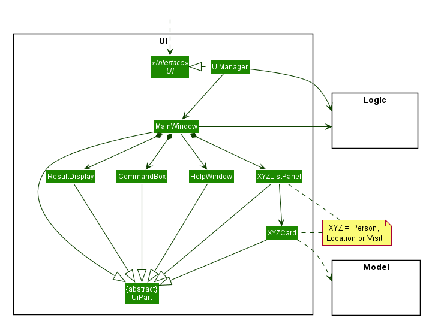

**API** :
[`Ui.java`](https://github.com/AY2021S1-CS2103T-T13-1/tp/blob/master/src/main/java/seedu/address/ui/Ui.java)

The UI consists of a `MainWindow` that is made up of parts e.g.`CommandBox`, `ResultDisplay`, `PersonListPanel`, `StatusBarFooter` etc. All these, including the `MainWindow`, inherit from the abstract `UiPart` class.

The `UI` component uses JavaFx UI framework. The layout of these UI parts are defined in matching `.fxml` files that are in the `src/main/resources/view` folder. For example, the layout of the [`MainWindow`](https://github.com/AY2021S1-CS2103T-T13-1/tp/tree/master/src/main/java/seedu/address/ui/MainWindow.java) is specified in [`MainWindow.fxml`](https://github.com/AY2021S1-CS2103T-T13-1/tp/tree/master/src/main/resources/view/MainWindow.fxml)

The `UI` component,

* Executes user commands using the `Logic` component.
* Listens for changes to `Model` data so that the UI can be updated with the modified data.

### Logic component

**API** :
[`Logic.java`](https://github.com/AY2021S1-CS2103T-T13-1/tp/tree/master/src/main/java/seedu/address/logic/Logic.java)

1. `Logic` uses the `VirusTrackerParser` class to parse the user command.
1. This results in a `Command` object which is executed by the `LogicManager`.
1. The command execution can affect the `Model` (e.g. adding a person).
1. The result of the command execution is encapsulated as a `CommandResult` object which is passed back to the `Ui`.
1. In addition, the `CommandResult` object can also instruct the `Ui` to perform certain actions, such as displaying help to the user.

Given below is the Sequence Diagram for interactions within the `Logic` component for the `execute("deletePerson 1")` API call.

:information_source: **Note:** The lifeline for `DeleteCommandParser` should end at the destroy marker (X) but due to a limitation of PlantUML, the lifeline reaches the end of diagram.

### Model component

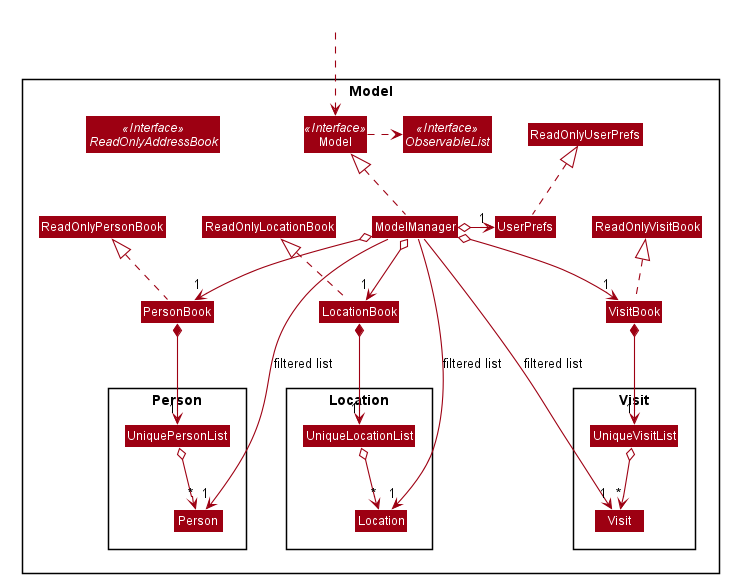

**API** : [`Model.java`](https://github.com/AY2021S1-CS2103T-T13-1/tp/tree/master/src/main/java/seedu/address/model/Model.java)

The `Model`,

* stores a `UserPref` object that represents the user’s preferences.
* stores a `PersonBook`, `LocationBook` and `VisitBook` for the three types of data.
* exposes an unmodifiable `ObservableList` of each type which can be 'observed' e.g. the UI can be bound to this list so that the UI automatically updates when the data in the list change.
* does not depend on any of the other three components.

The `Person`, `Location` and `Visit` components are shown in more detail below.

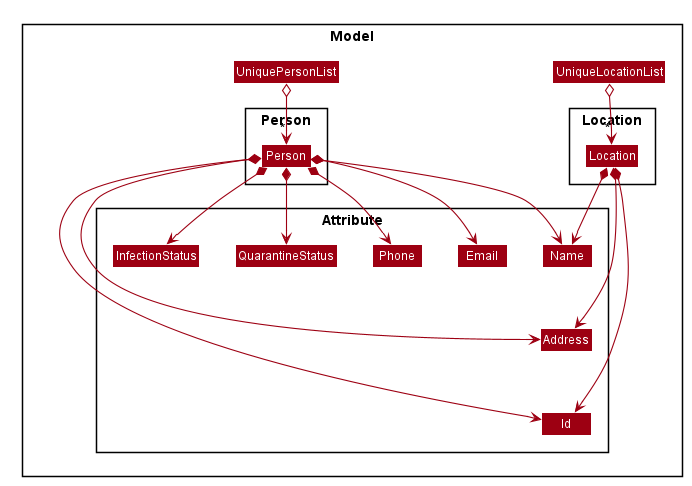
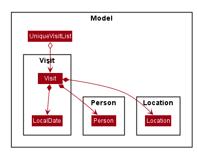

### Storage component

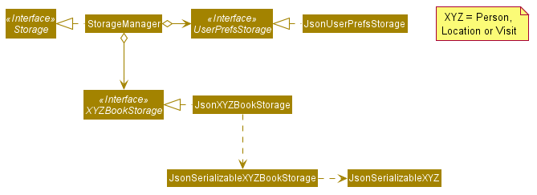

**API** : [`Storage.java`](https://github.com/AY2021S1-CS2103T-T13-1/tp/tree/master/src/main/java/seedu/address/storage/Storage.java)

The `Storage` component,
* can save `UserPref` objects in json format and read it back.
* can save the address book data in json format and read it back.

### Common classes

Classes used by multiple components are in the `seedu.address.commons` package.

--------------------------------------------------------------------------------------------------------------------

## **Implementation**

This section describes some noteworthy details on how certain features are implemented.

:information_source: **Note:** 
    Not all sections below will have a UML sequence/activity diagram. These diagrams serve to highlight the behaviours of the feature being discussed in the section.
    Should a diagram be omitted, the reader may assume that it has similar behaviour to similar features. 
    For example, the diagrams for `addLocation` and `addVisit` would be similar to `addPerson` hence only the `addPerson` section would have the diagrams. 

### Add person

This is a placeholder section for the "Manage data using CSV files section." Please update the link in that section if the header of this
section is changed.

### Add location

### Manage Persons, Locations and Visits using Unique Identifiers (Ho Pin Xian)

Person objects have different aspects (including Name, Address, Phone Number, infection status etc) but none of which can
uniquely identify a single Person. Family members may live in the same Address. Common names such as John may belong to multiple
people. Young people without their own phones may be using their house number or a parent's number.
The same can be said for Location objects as well. Hence, unique identifiers are required to uniquely and reliably identify
each Person and Location.

Since VirusTracker manages lists of Person and Location objects, it is necessary for VirusTracker to
uniquely identify the Person and Location involved in a Visit. Unique Identifiers have great significance within VirusTracker
and support many information generating functions and basic Model managing functions. 

An example of how VirusTracker makes use of Unique Identifiers will be shown in the following Add Visit command example.

:information_source: 
**Note:** Users may add Visits to VirusTracker via Unique Identifiers or Indexes. 
However, we will only be showing the Unique Identifier case in the following example.

#### Adding Visit using Unique Identifiers

Users may add a Visit from a specified Person to a specified Location on a specified date to the VirusTracker.
Notice how VirusTracker is able to identify the Person and Location involved in the Visit without requiring the user
to key in all properties of the Person and Location.

**Format:** `addVisit idp/PERSON_ID idl/LOCATION_ID d/DATE`

* `PERSON_ID` refers to the ID of the Person making the Visit. A Person with the specified ID must exist in VirusTracker.
* `LOCATION_ID` refers to the ID of the Location where the Visit is at. A Location with the specified ID must exist in VirusTracker.
* `DATE` is the date when the Visit occurred. 

#### Sequence diagram

The sequence diagram below shows how the adding operation works.

#### Activity diagram

The following activity diagram summarizes what happens when a user executes the `addVisit` command.

#### Design consideration

The design considerations below highlight alternative solutions to Unique Identifiers in the management of Persons and Locations within VirusTracker and provides reasons for the choice of implementation.

##### Aspect: User Input Identifiers Vs VirusTracker Created Identifiers
  
* **Alternative 1:** User Input Unique Identifiers.
  * User inputs Unique Identifier during creation of Person and Location objects.
 
* **Alternative 2:** VirusTracker Created Unique Identifiers.
  * VirusTracker creates a Unique Identifier for each Person and Location object upon creation.

For this aspect, we choose to make use of Unique Identifiers provided by the user as opposed to VirusTracker creating Unique Identifiers at the backend.
      
**Rationale**

The target audience of VirusTracker are healthcare officials in charge of managing the response to an infectious pandemic. 
It would thus be reasonable to assume that they have access to the Unique Identifiers given by the State to each Person.
In Singapore's context, this would refer to the NRIC number. Similarly, the same would go for Locations.

VirusTracker overloads functions to take in Unique Identifiers instead of Indexes as input when referring to Locations and Persons.
The benefit of using Unique Identifiers over Indexes is that users do not have to scroll the list to find the Index of the
Person/Location they wish to refer to. We expect that a user whom wants to generate data involving an object, would
already be aware of the state given Unique Identifier of the object. 

If VirusTracker creates the Unique Identifiers, this benefit would be lost since users will need to find the
Unique Identifier provided by the VirusTracker. 

### Deleting Visit using a specific Index (Shu long)
This feature allows the VirusTracker to delete the certain visit histories easily from the visit book as it may contain
incorrect information that does not contribute to contact tracing and generating the potential list for quarantine.
Hence, implementing this feature is necessary which enables the user to be more flexible in handling the data by 
removing the invalid visit record from the data before adding the updated version.

**Format:** `deleteVisit Index`

* `Index` refers to the Index of the targeted visit inside the displayed visit list. The targeted visit must exist in VirusTracker.

#### Implementation

* The visit that corresponds to the specified Index will be removed from the visit list.

#### Sequence diagram
The sequence diagram below shows how the deleteVisit operation works. Certain utility classes have been omitted for readability.

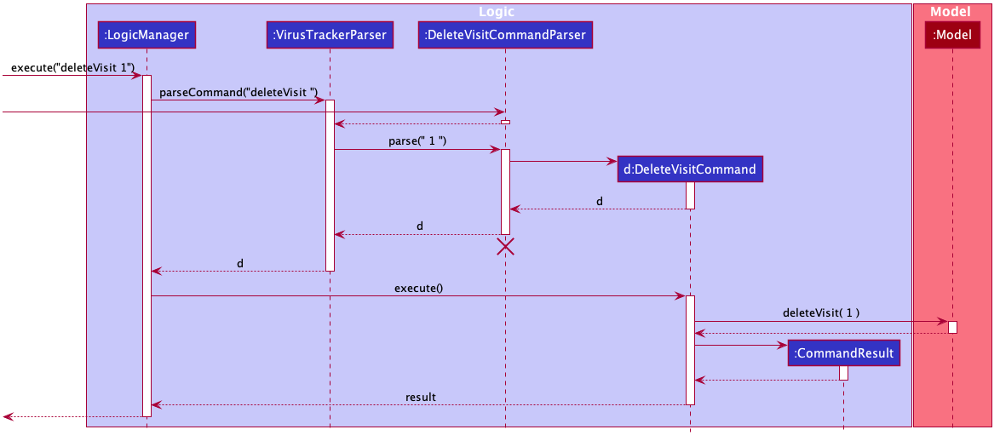

The following activity diagram summarizes what happens when a user executes the `deleteVisit 1` command.

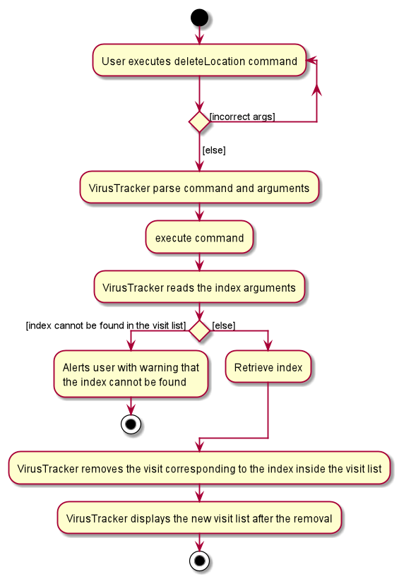

#### Design consideration

To specifically remove an invalid visit from the visit list, the index of that targeted visit as shown in the list offers an easy
way to quickly identify which visit the user is referring to, compared to using other fields of that visit information such
as the details of the person, details of the location and details of the location, which requires a lot of input from the user
for the same intended outcome.

### Deleting Visits using a specific date (Shu long)
This feature allows the VirusTracker to delete the outdated visit histories easily from the visit book as certain visit 
records will not contribute to contact tracing and generating the potential list for quarantine. The rationale is that 
the visits record before a time mark, for example 2 months ago, may not help to trace the recent list of contact 
for the new infected cases. Also, considering the number of visits made by all citizens in total, the data file size will be 
unnecessarily large, which not only makes the visit list harder to read, but also for the app slower to process with
the data. Hence, implementing this feature is necessary which enables the user to be more flexible in handling the data by 
removing the outdated visits record from the data.

**Format:** `deleteVisits d/Date`

#### Implementation

* Date is the targeted date set as the benchmark, all the visits that occur before and on the date itself will be deleted from the visit list.

#### Sequence diagram
The sequence diagram below shows how the deleteVisits operation works. Certain utility classes have been omitted for readability.

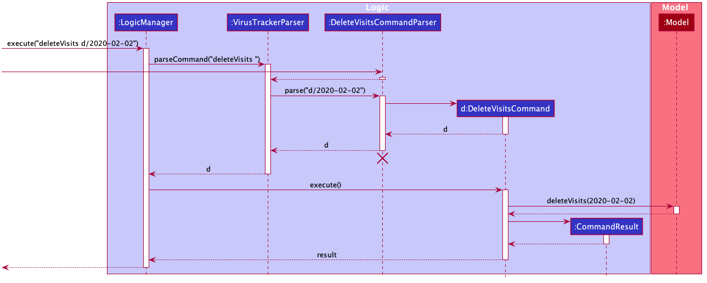

The following activity diagram summarizes what happens when a user executes the `deleteVisits d/Date` command.

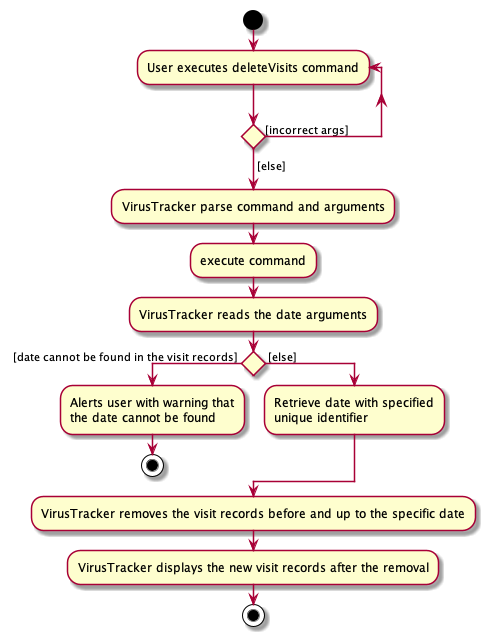

#### Design consideration

The design considerations below highlight alternative ways to delete Visits from the visit list

##### Aspect: Deleting visits using person and location vs using date

* **Alternative 1:** User delete Visits using a specific person or location.
  * All the visit records involving the specific person or the location will be deleted 

* **Alternative 2:** User delete Visits using a specific date.
  * All the visit records before and up to the date will be deleted 
  
For this aspect, we choose to use the second alternative using the specific date 

**Rationale**

The use of the visit records data is to assist contact tracing if an infected case is reported and the relevant information
such as the list of potential infected and infected places could then be generated by comparing the visits records of the infected with
other people's visit record. However, as the infected patients are only able to transmit the virus within a certain time frame,
e.g. two weeks or more, the visit records in the far past may not be helpful for generating the useful information.

Deleting by date allows the user to easily get rid of the outdated visit records data. In comparison, deleting by person and location serve
less of such purposes. It is only helpful when the location or the person information turns out to be invalid and hence
need to be removed. This implementation can be merged into the execution of deleting location or deleting person command.
Also, deleting by location and person tend to be much slower compared to using dates, especially when the number of people 
and locations are large.

### Manage data using CSV files (Siang Ern)

Most data collected by the target user group are likely to be in the form of Excel documents. As such, it is necessary for VirusTracker to include features to import and export data in a way that is compatible with Excel.

The features are facilitated by the `addFromCsv` and `exportToCsv` commands. They allow VirusTracker to manage data using **Comma-separated values** files which could also be handled by Excel.

#### Importing data from a CSV file

This feature essentially acts as a "bulk add" operation. The number of rows in the CSV file corresponds to the **maximum** number of objects that could be added to VirusTracker.

**Format:** `addFromCsv FILEPATH l/LIST_TYPE`

* `FILEPATH` refers to the absolute path that the file would be located at.
* `LIST_TYPE` is the data type that the user is attempting to add. The `addFromCsv` command supports three list types:
    1. [people](#add-person)
    2. [locations](#add-location)
    3. [visits](#adding-visit-using-unique-identifiers)
* Each row in the specified CSV file must follow the format for the add command of the respective type. To find out about the format, you may click the relevant list type above.

An example of a CSV file that is used to add people is shown below. Notice that column G is not completely filled as the field is optional.

:information_source: **Note:** The number of columns in the CSV file should correspond to the number of parameters required to create the related object. Information on additional columns **will be disregarded**.

#### Sequence diagram

The sequence diagram below shows how the adding operation works. Certain utility classes have been omitted for readability.

:information_source: **Note:** Lifelines should end at the destroy marker (X) but due to a limitation of PlantUML, the lifeline reaches the end of diagram.

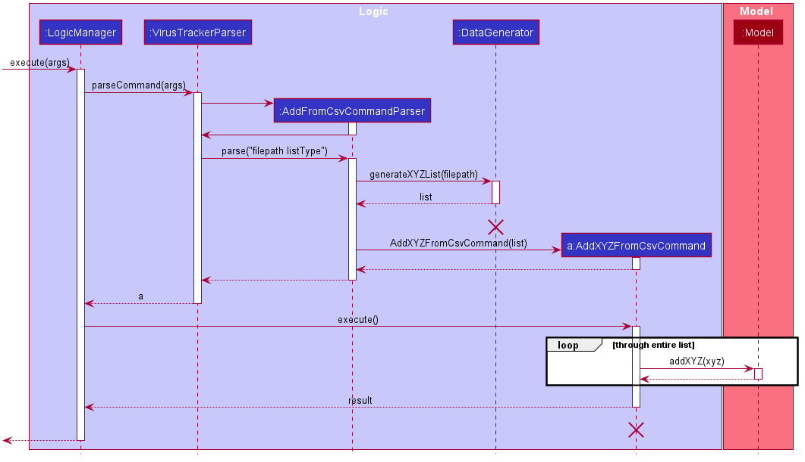

:information_source: **Note:** `XYZ` in the above sequence diagram can be used to denote either Persons, Locations or Visits.
For example, `generateXYZList` could be `generatePersonsList`, `generateLocationsList` or `generateVisitsList`. The behaviour of the three different entities are the same as the above sequence diagram.

:information_source: **Note:** `listType` determines the type of entity to be used for `XYZ`.

The following activity diagram summarizes what happens when a user executes the `addFromCsv` command.

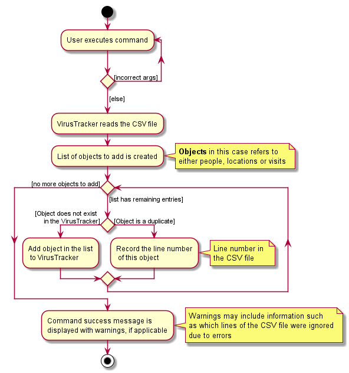

#### Design consideration

The design considerations below highlight alternative ways the command could have been implemented, and provides reasons for the choice of implementation.

##### Aspect: How are exceptions handled

For this aspect, we make a distinction between fatal exceptions and non-fatal exceptions.

* Fatal exceptions
  * Exceptions that cause the command to be unable to execute further.
  * These exceptions include but are not limited to: _missing parameters in CSV file_, _invalid file path, etc._    

* Non-fatal exceptions
  * The command could still continue executing even if this exception occured.
  * For example, _duplicate objects in the CSV file._
  * They tend to occur on a row by row basis in the CSV file.
  
* **Alternative 1:** Stop execution of command only for destructive exceptions.
  * Pros: User does not need to rerun the command for every exception that occurs.
  * Cons: Allowing certain exceptions to pass through may result in some bugs further down the line.

* **Alternative 2:** Stop execution for every exception that occurs.
  * Pros: Ensures correctness of the added objects.
  * Cons: May lead to worse user experience having to constantly rerun the command.

**Implementation**
 
Alternative 1 was chosen as the implementation with considerations from alternative 2.
* Upon encountering:
  * Fatal exception
    * The command stops execution and informs the user of the error.
  * Non-fatal exception
    * The command continues executing.
    * The rows where the exception occurs are recorded.
    * Upon finishing execution, the user is informed of the success and notified of the erroneous rows.
    
**Rationale**

As this command handles data from CSV files, it is likely the CSV files would be large (containing more than 10,000 rows).
  * Time taken for the `addFromCsv` command to execute is significant.
  
As such, the above implementation helps to reduce the need to read the large file repeatedly. 
  * User can fix the erroneous rows on a new CSV file.
  * Execution of the command would be faster than if the same large file was executed again.

This would minimise the impact to user experience as the user would spend less time fixing the errors.

##### Aspect: Absolute file path

The file path the command uses is the absolute path.
* The absolute path provides the complete details to locate the CSV file.
* Helps to avoid navigation errors that may result from using relative path names.

By allowing the user to specify the path name, it also gives the user a choice on where to put his CSV files instead of enforcing a particular directory for
him to store the files.

**Note:** While it is recommended for the user to use absolute file paths, there is nothing enforcing the user to do so. In the case when the user specfies a relative path,
VirusTracker would still attempt to locate the path, starting from the directory that the application is placed in. However, it is still required that the file path provided be valid.

##### Aspect: Reusing list types and the list prefix 'l/'

**Concern**: The list types are used for the `list` command, which appear to be unrelated to the `addFromCsv` command.

**Rationale**

This command handles people, locations and visits which corresponded to the list types already implemented for use for the list command.

By using a format similar to the `list` command, it avoids the need for implementing a possible **data type** parameter which would not have a
significant difference from list type.

Furthermore, it allows the user to use a format that they are already comfortable with.

### List high risk locations of infection
This feature allows the VirusTracker to display a list high risk location of infection. This list of high risk location 
of infection is generated using data currently stored in VirusTracker. The data include the infection status of all 
people, all visits that are made by infected people and all locations. 

**Format:** `list l/high-risk-locations`

#### Implementation
This feature is one of the different `list` commands. It has the same command word as other `list` commands, which is 
`list`. The `LIST_TYPE` of this command is `high-risk-location`.

* Infected person is defined as person with infection status as `true`
* Infected visit is defined as visit made by any infected person
* Infected location is defined as location that has been visited by any infected person
* Number of high risk location of infection is defined as:    
    * If number of infected location is larger than 60% of number of total number of location, then the number of high risk 
location is `40% * (number of total locations)`.  
    * Else, number of high risk location is the number of infected location. 

1. When this command is executed, a list of all infected people is obtained.
2. A list of all visits made by all infected people is obtained using the list of infected people.
3. Use a `HashMap` to store the location as the key and the number of visits made by any infected person to this 
location as the value. Generate this `HashMap` from the list of visits in step 2.
4. Sort the `HashMap` in Step 3 from most infected visits to least infected visits.
5. Calculate the number of high risk locaiton `n`, using number of infected location and number of total location.
6. Display the top `n` locations of the sorted infected location list as the list of high risk locations.

#### Sequence diagram
The sequence diagram below shows how the list operation works. Certain utility classes have been omitted for readability.

The following activity diagram summarizes what happens when a user executes the `list l/high-risk-locations` command.

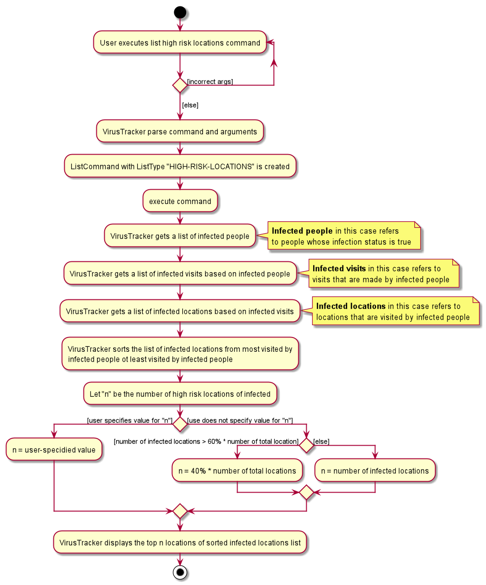

#### Design consideration
##### Aspect: Definition of number of high risk location of infection
When displaying the list of high risk location of infection, the top few locations that has been most visited by any 
infected people are wanted. 

If number of infected location is larger than 60% of number of total number of location, then the number of high risk 
location is `40% * (number of total locations)`.  The number `40%` is an appropriate number as not too many nor too few
infected locations will be displayed.

Else, number of high risk location is the number of infected location. Since less than 40% of total locations are 
infected, all infected locations can be considered as high risk because they are the only few locations that are infected.

### GUI Functionality for displaying lists of people, locations and visits (Koh Han Ming)
VirusTracker manages lists of person, location and visit objects. Accordingly, it needs to be able to display the information stored in these objects in a meaningful way. As the lists can be updated, the information displayed must also be changed.
These changes will be reflected on the GUI every time a list is updated. The lists are updated when the user inputs one of the following commands:

1. Adding data: `add`
2. Deleting data: `delete`
3. Editing data: `edit`
4. Finding data: `find`
5. Listing data: `list`
6. Generating people in contact with an infected person: `generatePeople`
7. Generating locations an infected person has been to: `generateLocations`

#### Sequence diagram
The sequence diagram below shows how the GUI updates using the list all people command as an example: `list l/people`

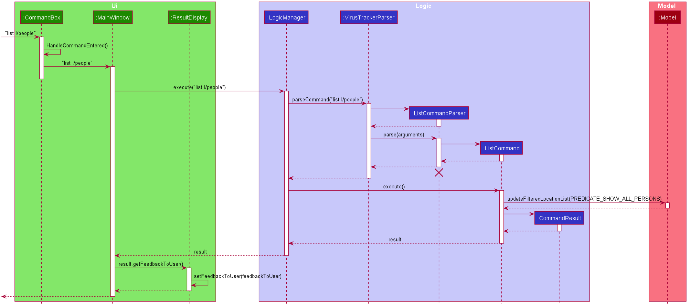

#### Activity diagram
The activity diagram below shows how the GUI updates using the list all people command as an example: `list l/people`

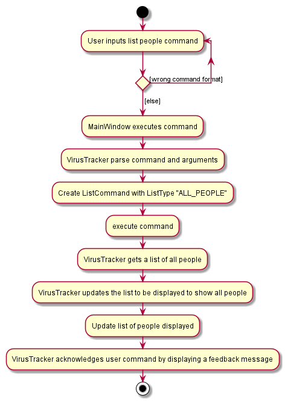

--------------------------------------------------------------------------------------------------------------------

## **Documentation, logging, testing, configuration, dev-ops**

* [Documentation guide](Documentation.md)
* [Testing guide](Testing.md)
* [Logging guide](Logging.md)
* [Configuration guide](Configuration.md)
* [DevOps guide](DevOps.md)

--------------------------------------------------------------------------------------------------------------------

## **Appendix: Requirements**

### Product scope

**Target user profile**:

* is a healthcare official involved in the Covid-19 pandemic
* has a need to generate statistics based on input data of the pandemic
* prefer desktop apps over other types
* can type fast
* prefers typing to mouse interactions
* is reasonably comfortable using CLI apps

**Value proposition**: produce useful statistics quickly and efficiently

### User stories

(For all user stories below, the **user** is a healthcare official, unless stated otherwise)

Priorities: High (must have) - `* * *`, Medium (nice to have) - `* *`, Low (unlikely to have) - `*`

| Priority | As a …​                                    | I want to …​                     | So that I can…​                                                        |
| -------- | ------------------------------------------ | ------------------------------ | ---------------------------------------------------------------------- |
| `* * *`  | user | generate a list of people currently stored in VirusTracker|  
| `* * *`  | user | generate a list of locations currently stored in VirusTracker|    
| `* * *`  | user | generate a list of visits currently stored in VirusTracker|   
| `* * *`  | user | add a person's data to a list | update the list of people that are currently being tracked |
| `* * *`  | user | delete a person's data | to keep the persons list up to date |
| `* * *`  | user | edit a person's data | to keep the person's information up to date | 
| `* * *`  | user | add location data to a list | update the list of locations that are currently being tracked |

| Priority | As a …​                                    | I want to …​                     | So that I can…​                                                        |
| -------- | ------------------------------------------ | ------------------------------ | ---------------------------------------------------------------------- |  
| `* * *`  | user | delete location data | to keep the locations list up to date |
| `* * *`  | user | edit location data | to keep the location information up to date with the latest address or name |
| `* * *`  | user with access to visits data from SafeEntry app  | add visit data to a list | track contacts with the infected cases |
| `* * *`  | user | delete visit data | remove visits when they are no longer relevant |
| `* * *`  | user | edit visit data | to update information about the visit |
| `* * *`  | user | generate a list of infected people currently stored in VirusTracker|    
| `* * *`  | user | generate a list of quarantined people currently stored in VirusTracker|  

| Priority | As a …​                                    | I want to …​                     | So that I can…​                                                        |
| -------- | ------------------------------------------ | ------------------------------ | ---------------------------------------------------------------------- |  
| `* * *`  | user with access to the visit list| delete all visits past a certain date | remove all the outdated visits inside the visit list at once |
| `* * *`  | user setting up SafeEntry checkpoints | identify locations with high risk of infection | know which places need these checkpoints the most |
| `* * *`  | user publishing daily reports | generate daily statistics quickly and easily|                                                         |
| `* * *`  | user managing infected patients | update people's infection status | keep the current epidemic situation up to date |
| `* * *`  | user managing quarantined people | update people's quarantine status | be aware of a person's quarantine status |
| `* * *`  | user worried about virus outbreaks | generate locations that infected people have been to | disinfect those locations |
| `* * *`  | user worried about virus outbreaks | generate people that have been in contact with infected people | quarantine them for safety measures |
| `* * *`  | user with data stored in Excel files | import data from Excel files into VirusTracker | integrate the use of VirusTracker into existing data |

| Priority | As a …​                                    | I want to …​                     | So that I can…​                                                        |
| -------- | ------------------------------------------ | ------------------------------ | ---------------------------------------------------------------------- |
| `* * *`  | user | export data from VirusTracker into a portable format | use the same data on multiple devices |

### Use cases

(For all use cases below, the **System** is the `VirusTracker` and the **Actor** is the `user`, unless specified otherwise)

**UC01 - Add a Person**

**MSS**

1.  User enters the details to add a person to the persons list.
2.  System adds the new person.
3.  System displays the updated persons list.

    Use case ends.

**Extensions**
      
* 2a. System detects error in the entered data.
    * 2a1. System prompts user for correct data.
    * 2a2. User enters new data.  
    Steps 2a1-2a2 are repeated until the data entered are correct.  
    Use case resumes at step 3.
         
    Use case ends.

**UC02 - Delete a Person**

**MSS**

1. User enters the details to remove a certain person from the persons list.
2. System deletes the person based on the information entered.
3. System displays the updated persons list.  
   
   Use case ends.
      
**Extensions**
       
* 2a. System detects error in the entered data.
    * 2a1. System prompts user for correct data.
    * 2a2. User enters new data.  
    Steps 2a1-2a2 are repeated until the data entered are correct.  
    Use case resumes at step 3.
         
    Use case ends.

 
**UC03 - Edit a Person**

**MSS**

1. User enters the details to edit a certain person from the persons list.
2. System edits the person based on the information entered.
3. System displays the updated persons list.  
   
   Use case ends.
      
**Extensions**
       
* 2a. System detects error in the entered data.
    * 2a1. System prompts user for correct data.
    * 2a2. User enters new data.  
    Steps 2a1-2a2 are repeated until the data entered are correct.  
    Use case resumes at step 3.
         
    Use case ends.
    
**UC04 - Find a Person**

**MSS**

1. User enters the details to find a certain person from the persons list.
2. System searches for the targeted person.  
3. System displays the targeted person.  
   
   Use case ends.
      
**Extensions**
       
* 2a. System detects error in the entered data.
    * 2a1. System prompts user for correct data.
    * 2a2. User enters new data.  
    Steps 2a1-2a2 are repeated until the data entered are correct.  
    Use case resumes at step 3.
         
    Use case ends.    
    

**UC05 - Add a location**

**MSS**

1.  User adds a location.
2.  System adds the new location.
3.  System displays the updated locations list.

    Use case ends.

**Extensions**
      
* 2a. System detects error in the entered data.
    * 2a1. System prompts user for correct data.
    * 2a2. User enters new data.  
    Steps 2a1-2a2 are repeated until the data entered are correct.  
    Use case resumes at step 3.
    
    Use case ends.

**UC06 - Delete a location**

**MSS**

1.  User identifies a location to be deleted.
2.  System deletes the location.
3.  System displays the updated locations list.

    Use case ends.

**Extensions**
      
* 2a. System detects that location does not exist.
    * 2a1. System prompts user for location to be deleted.
    * 2a2. User enters new data.  
    Steps 2a1-2a2 are repeated until the data entered are correct.  
    Use case resumes at step 3.
    
    Use case ends.

**UC07 - Edit a location**

**MSS**

1.  User edits a location.
2.  System updates the old location with the edited location.
3.  System displays the updated locations list.

    Use case ends.

**Extensions**
      
* 2a. System detects error in the entered data.
    * 2a1. System prompts user for correct data.
    * 2a2. User enters new data.  
    Steps 2a1-2a2 are repeated until the data entered are correct.  
    Use case resumes at step 3.
    
    Use case ends.

**UC08 - Add a visit**

**MSS**

1.  User enters the details to add a visit to the visits list.
2.  System adds the new visit.
3.  System displays the updated visits list.

    Use case ends.

**Extensions**
      
* 2a. System detects error in the entered data.
    * 2a1. System prompts user for correct data.
    * 2a2. User enters new data.  
    Steps 2a1-2a2 are repeated until the data entered are correct.  
    Use case resumes at step 3.
         
    Use case ends.

**UC09 - Delete a visit**

**MSS**

1. User enters the details to remove a certain visit from the visits list.
2. System deletes the visit based on the information entered.
3. System displays the updated visits list.  
   
   Use case ends.
      
**Extensions**
       
* 2a. System detects error in the entered data.
    * 2a1. System prompts user for correct data.
    * 2a2. User enters new data.  
    Steps 2a1-2a2 are repeated until the data entered are correct.  
    Use case resumes at step 3.
         
    Use case ends.
    
**UC10 - Delete visits by date**

**MSS**

1. User enters the details to clear all the visits up to and before a date.
2. System deletes the visits based on the information entered.
3. System displays the updated visits list.  
   
   Use case ends.
      
**Extensions**
       
* 2a. System detects error in the entered data.
    * 2a1. System prompts user for correct data.
    * 2a2. User enters new data.  
    Steps 2a1-2a2 are repeated until the data entered are correct.  
    Use case resumes at step 3.
         
    Use case ends.

**UC11 - Update infection status**

**MSS**

1. User provides updated quarantine status of a person.
2. System updates the quarantine status of the person.
3. System shows the list of people.

Use case ends.

**Extension**

* 2a. System is unable to find the person specified by the user.     
    * 2a1. System requests for correct details of the person.
    * 2a2. User enters the new details.  
    
  Steps 2a1 - 2a2 are repeated until the person specified by the user exists.  
  
  Use case resumes from step 3.
  
* *a. At any time, user choose to cancel the update.  
    
    Use case ends.  
            
**UC12 - Update quarantine status**

**MSS**

1. User provides updated quarantine status of a person.
2. System updates the quarantine status of the person.
3. System shows the list of people.

**Extension**

* 2a. System is unable to find the person specified by the user.     
    * 2a1. System requests for correct details of the person.
    * 2a2. User enters the new details.  
    
  Steps 2a1 - 2a2 are repeated until the person specified by the user exists.  
  Use case resumes from step 3.
  
* *a. At any time, user choose to cancel the update.    
    Use case ends.  

**UC13 - View all people**

**MSS**

1. User requests to list all people.
2. System shows a list of all people.

    Use case ends.

**Extensions**

* 2a. The list is empty.
    * 2a1. System generates a sample list.
    * 2a2. System shows the sample list.
    
  Use case ends.
    
**UC14 - View all locations**

**MSS**

1. User requests to list all locations.
2. System shows a list of all locations.

    Use case ends.

**Extensions**

* 2a. The list is empty.
    * 2a1. System generates a sample list.
    * 2a2. System shows the sample list.
    
  Use case ends.
    

**UC15 - View all visits**

**MSS**

1. User requests to list all visits.
2. System shows a list of all visits.

    Use case ends.

**Extensions**

* 2a. The list is empty.
    * 2a1. System generates a sample list.
    * 2a2. System shows the sample list.
    
  Use case ends.
    
**UC16 - View all infected people**

**MSS**

1. User requests to list all infected people
2. System shows a list of all infected people.

    Use case ends.

**Extensions**

* 2a. The list is empty.

  Use case ends.

* 2b. There are no infected people.
    * 2b1. Go to 2a.

**UC17 - View all quarantined people**

**MSS**

1. User requests to list all quarantined people
2. System shows a list of all quarantined people.

    Use case ends.

**Extensions**

* 2a. The list is empty.

  Use case ends.

* 2b. There are no quarantined people.
    * 2b1. Go to 2a.
    
**UC18 - View locations that an infected person has been to**

**MSS**

1. User requests to list locations that an infected person has been to.
2. System shows a list of locations that the infected person has been to.  

  Use case ends.

**Extensions**

* 3a. The list is empty.

    Use case ends.
    
* 2b. The person is not infected.

    Use case ends. 
    
* 2c. The system detects invalid user input.
    * 2c1. The system prompts the user to enter valid input.
    * 2c2. User enters new input.
    Steps 2c1-2c2 are repeated until the input entered is correct.  
        Use case resumes at step 2.
        
        Use case ends.       

**UC19 - View people in contact with an infected person**

**MSS**

1. User requests to list people in contact with an infected person.
2. System finds the infected person.
3. System shows a list of people in contact with an infected person.  

  Use case ends.

**Extensions**

* 3a. The list is empty.

    Use case ends.   
    
* 2b. The person is not infected.

    Use case ends. 
    
* 2c. The system detects invalid user input.
    * 2c1. The system prompts the user to enter valid input.
    * 2c2. User enters new input.
    Steps 2c1-2c2 are repeated until the input entered is correct.  
        Use case resumes at step 2.
        
        Use case ends.  
    
**UC20 - View high-risk locations**

**MSS**

1. User requests to list locations with high risk of infection.
2. System shows a list of locations with high risk.  

  Use case ends.

**Extensions**

* 2a. The location list is empty.

    Use case ends.

**UC21 - View summary of data**

**MSS**

1. User requests to view statistics of the day.
2. System shows the statistics of the day.

  Use case ends.

**Extensions**

* 2a. There is not enough information to produce a certain statistics.
    * 2a1. System flags that statistic as unavailable.
    * 2a2. For remaining valid statistics, go to 2. 
    
**UC22 - Add data from CSV file**

**MSS**

1. User requests to add data from a CSV file.
2. System requests for information for adding.
3. User enters the information required.
4. System adds the items and informs the user.

  Use case ends.

**Extensions**

* 3a. There is an error in the information entered.
    * 3a1. System requests for correct information.
    * 3a2. User enters new input.
    
    Steps 3a1 - 3a2 are repeated until the information entered is correct.  
        Use case resumes at step 3.
* 4a. The system is unable to add certain items in the file.
    * 4a1. System records the errors and notifies the user.
    
    System may decide to continue adding items. In that case, return to step 4.
    Otherwise, use case ends.

**UC23 - Export data to a CSV file**

**MSS**

1. User requests to export data to a CSV file.
2. System requests for information.
3. User enters the information required.
4. System exports the item to a CSV file and informs the user.

  Use case ends.

**Extensions**

* 3a. There is an error in the information entered.
    * 3a1. System requests for correct information.
    * 3a2. User enters new input.
    
    Steps 3a1 - 3a2 are repeated until the information entered is correct.  
        Use case resumes at step 3.
* 4a. The system is unable to export data to a file.
    * 4a1. System informs the user of the error.
   
    Use case ends.
  
### Non-Functional Requirements

1.  Should work on any _mainstream OS_ as long as it has Java `11` or above installed.
2.  Should be able to hold up to 1000 items for each type of list without a noticeable sluggishness in performance for typical usage.
3.  Should be able to switch between different types of data and manipulate them efficiently and quickly.
4.  A user with above average typing speed for regular English text (i.e. not code, not system admin commands) should be able to accomplish most of the tasks faster using commands than using the mouse.
5.  Summary of statistics presented should be relevant and useful to the reader.

### Glossary

| Term       | Meaning                                                                                |
|------------|----------------------------------------------------------------------------------------|
| Entity     | Refers to people, locations or visits                                                  |
| Command    | Refers to user input that instructs VirusTracker on what to do                         |
| Identifier | Refers to ids or indexes. These are used to uniquely identify a location or person     |
| Prefix     | Refers to prefixes used in commands. These precede fields that are typed in user input |
| Visit      | A visit event occurs whenever a `Person` enters a `Location`. The `Date` of this visit is also recorded. |
| Mainstream OS | Windows, Linux, Unix, OS-X |
| Private contact detail | A contact detail that is not meant to be shared with others |

--------------------------------------------------------------------------------------------------------------------

## **Appendix: Instructions for manual testing**

Given below are instructions to test the app manually.

:information_source: **Note:** These instructions only provide a starting point for testers to work on;
testers are expected to do more *exploratory* testing.

### Launch and shutdown

1. Initial launch

   1. Download the jar file and copy into an empty folder

   1. Double-click the jar file Expected: Shows the GUI with a set of sample contacts. The window size may not be optimum.

1. Saving window preferences

   1. Resize the window to an optimum size. Move the window to a different location. Close the window.

   1. Re-launch the app by double-clicking the jar file. 
       Expected: The most recent window size and location is retained.

1. _{ more test cases …​ }_

### Deleting a person

1. Deleting a person while all persons are being shown

   1. Prerequisites: List all persons using the `list` command. Multiple persons in the list.

   1. Test case: `delete 1` 
      Expected: First contact is deleted from the list. Details of the deleted contact shown in the status message. Timestamp in the status bar is updated.

   1. Test case: `delete 0` 
      Expected: No person is deleted. Error details shown in the status message. Status bar remains the same.

   1. Other incorrect delete commands to try: `delete`, `delete x`, `...` (where x is larger than the list size) 
      Expected: Similar to previous.

1. _{ more test cases …​ }_

### Saving data

1. Dealing with missing/corrupted data files

   1. _{explain how to simulate a missing/corrupted file, and the expected behavior}_

1. _{ more test cases …​ }_
