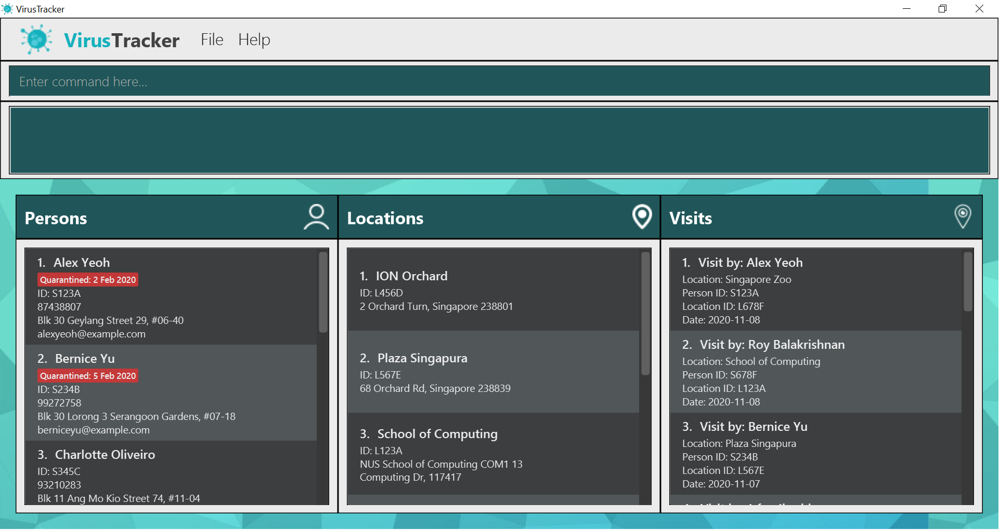
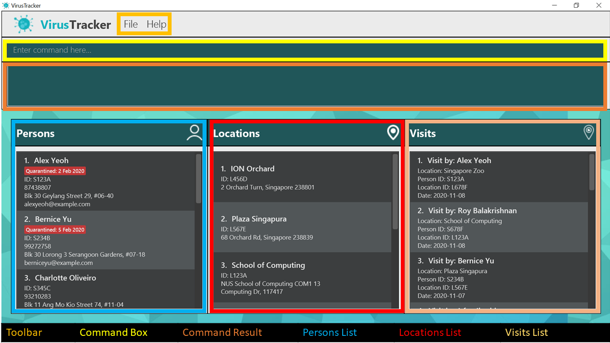
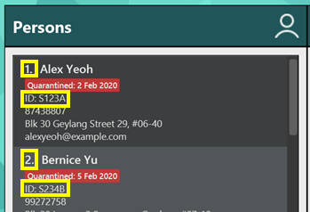
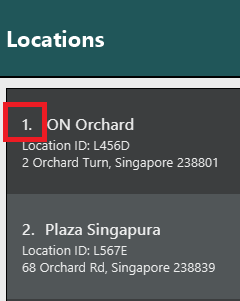
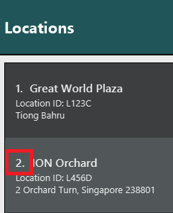
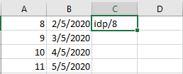
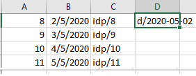
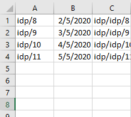

Table of Contents
- [Preface](#preface)
- [Notations (Pin Xian)](#notations)
- [Glossary (Pin Xian)](#glossary)
- [Quick start](#quick-start)
- [User Interface (Pin Xian)](#user-interface)
- [Features](#features)
  * [Valid Formats for Command Parameters (Pin Xian)](#valid-formats-for-command-parameters)
    + [Email Format](#email-format)
  * [Indexes and Ids (Pin Xian)](#indexes-and-ids)
  * [Adding data](#adding-data)
    + [Adding a person](#adding-a-person)
    + [Adding a location](#adding-a-location)
    + [Adding a visit](#adding-a-visit)
  * [Listing data](#listing-data)
    + [Listing all people](#listing-all-people)
    + [Listing all infected people](#listing-all-infected-people)
    + [Listing all quarantined people](#listing-all-quarantined-people)
    + [Listing all locations](#listing-all-locations)
    + [Listing all visits](#listing-all-visits)
    + [Listing high risk locations](#listing-high-risk-locations)
    + [Listing summary of data](#listing-summary-of-data)
  * [Using CSV files (Siang Ern)](#using-csv-files)
      + [Adding data from CSV files](#adding-data-from-csv-files)
      + [Exporting data to CSV files](#exporting-data-to-csv-files)
      + [Format for CSV files](#format-for-csv-files)
        - [Using Excel to add prefixes](#using-excel-to-add-prefixes)
        - [Replacing the data](#replacing-the-data)
  * [Deleting data](#deleting-data)
    + [Deleting a person](#deleting-a-person)
    + [Deleting a location](#deleting-a-location)
    + [Deleting a visit](#deleting-a-visit)
    + [Deleting visits using date](#deleting-visits-using-date)
    
    

  * [Editing data](#editing-data)
    + [Editing a person](#editing-a-person)
    + [Editing a location](#editing-a-location)
  * [Finding persons by name](#finding-persons-by-name)
  * [Generating all locations visited by a person](#generating-all-locations-visited-by-a-person)
  * [Generating all people in contact with an infected person](#generating-all-people-in-contact-with-an-infected-person)
  * [Clearing all entries](#clearing-all-entries)
  * [Viewing help](#viewing-help)
  * [Exiting the program](#exiting-the-program)
  * [Saving the data](#saving-the-data)
- [FAQ](#faq)

---

**VirusTracker** is a **desktop app** for generating statistics for Covid-19, optimized for use via a **Command Line Interface** (CLI) while still having the benefits of a **Graphical User Interface** (GUI).
It is mainly targeted towards healthcare officials who are handling large amounts of data due to the pandemic.
VirusTracker aims to provide a faster and quicker alternative to common statistical programs.

--------------------------------------------------------------------------------------------------------------------

## Preface

Welcome to the user guide on VirusTracker.

This guide will guide you through the different features that VirusTracker has to offer.
VirusTracker works with three main entities:
* People
* Locations
* Visits

A person refers to any person who may be at risk from Covid-19. VirusTracker stores data about the Id, name, address, phone number and email of each person.
Furthermore, the infection and quarantine statuses of each person are stored within VirusTracker. 

A location refers to any location which are open for visiting. VirusTracker stores the Id, name and address of each location.

A visit refers to when a person visits a location on a given date. VirusTracker stores the date and data of the person and location involved in the visit.

The recommended way for you to use VirusTracker is to first store the information of all the people and locations you wish to track.
Then, whenever a person visits a location, add the corresponding visit.

VirusTracker would be able to generate useful information for you based off the data that is input into the system.

While VirusTracker is created with the purpose of processing data from Covid-19, VirusTracker can also monitor other
future epidemics or pandemics.

--------------------------------------------------------------------------------------------------------------------

## Notations

Our user guide uses the following notations. Each notation has a different meaning to help you understand this guide better.

 

:information_source: **Note:**

Presents information which are helpful to take note about. 

:bulb: **Tip:**

Good to learn, but not necessary to know.

:warning: **Warning:**

Focuses on information that you should be careful about. Being cautious is recommended.

--------------------------------------------------------------------------------------------------------------------

## Glossary

The following table presents a list of key terms that will be used in this user guide. 

| Term       | Meaning                                                                                     |
|------------|---------------------------------------------------------------------------------------------|
| Entity     | Refers to people, locations and visits.                                                     |
| Command    | Refers to user input that instructs VirusTracker on what to do.                             |
| Identifier | Refers to Ids and indexes. These can uniquely identify a location or person.                |
| Prefix     | Refers to prefixes used in commands. These precede parameters that are typed in user input.   An example is `n/John` where `n/` is the prefix for names. |
| Data       | Refers to the information on people, locations and visits stored in VirusTracker.           |

--------------------------------------------------------------------------------------------------------------------

## Quick start

1. Ensure you have Java `11` or above installed in your computer.

2. Download the latest `VirusTracker.jar` from [here](https://github.com/AY2021S1-CS2103T-T13-1/tp/releases).  
   
3. Copy the file to the folder you want to use as the _home folder_ for your VirusTracker.

4. Double-click the file to start the app. The GUI similar to the figure below should appear in a few seconds. Note how VirusTracker contains some sample data. 
   

    

5. Type the command in the command box and press Enter to execute it. e.g. You may type **`help`** and press Enter to open the help window. 
   Here are some example commands you can try:
   
   * **`addLocation`**`idl/L789A n/NTU a/50 Nanyang Ave, 639798` : Adds a location named `NTU` to VirusTracker.

   * **`deletePerson`**`3` : Deletes the 3rd person shown in the current list.

   * **`addVisit`**`1 1 d/2020-11-08` : Adds a visit made by the 1st person shown on the list to the 1st location shown on the list on 8 November 2020.

   * **`clear`** : Deletes all entries from VirusTracker.

   * **`exit`** : Exits the app.

6. You may refer to the [Features](#features) below for further details about each command.

--------------------------------------------------------------------------------------------------------------------

## User Interface

You may refer to the figure and table below to understand the different components of the user interface.  

 

The table below explains the purpose of each component in the user interface.

| Component       | Description                              |
| --------------- | ---------------------------------------- | 
| Toolbar         | Displays the toolbar for VirusTracker. You may click on `File` and `Help` to see the exit and help buttons respectively.  | 
| Command Box     | You may type your inputs into this textbox.    | 
| Command Result  | VirusTracker displays responses inside this box. You may read success messages or warnings from this box. | 

| Component       | Description                              |
| --------------- | ---------------------------------------- | 
| Persons List    | Displays a list of people. Panels contain detailed information about each person. This list is sorted by name followed by Id. |
| Locations List  | Displays a list of locations. Panels contain detailed information about each location. This list is sorted by name followed by Id. | 
| Visits List     | Displays a list of visits. Panels contain information about the person, location and date of the visit. This list is sorted by date, followed by person, then location. | 

--------------------------------------------------------------------------------------------------------------------

## Features

This section introduces you to important notations and details that apply to the commands in VirusTracker.

**:information_source: Notes about the command format:** 

* Words in `UPPER_CASE` are parameters for you to give. 
  e.g. in `addPerson n/NAME`, `NAME` is a parameter which can be used as `addPerson n/John Doe`.

* Items in square brackets are optional. 
  e.g `list [high-risk-location-number] l/high-risk-locations` can be used as `list 5 l/high-risk-locations` or as `list l/high-risk-locations`.

* You can give the parameters with prefixes in any order. 
  e.g. if the command specifies `n/NAME p/PHONE_NUMBER`, `p/PHONE_NUMBER n/NAME` is also acceptable.

* If you give multiple responses to the same parameter, VirusTracker takes the last response. 
  e.g. Given the command format `addPerson n/NAME p/PHONE_NUMBER` and your command `addPerson n/John p/12345678 p/87654321`,
  VirusTracker takes the phone number to be `87654321` and ignores `12345678`.

* VirusTracker will actively stop the user from creating duplicates of entities. VirusTracker will alert you if it detects you are adding a duplicate entity.
  Entities are duplicates if they meet any of the following conditions.
  1. For visits, they are duplicates if they have the same date and involve the same person and location.
  2. For persons, they are duplicates if either
       - their name and phone are the same or
       - their name and email are the same or
       - they have the same Id.
  3. For locations, they are duplicates if either
       - they have the same address or
       - they have the same Id. 

### Valid Formats for Command Parameters

From the following table, you may see a list of command parameters that are found in this user guide.
Each row shows the parameter, the corresponding prefix and conditions for the parameter to be valid. 

| Parameter | Prefix | Valid Format |
| ----------| ------ | ------------ | 
| Date      |  d/    | Date format should follow `yyyy-mm-dd`.  e.g. 23 January 2020 is "2020-01-23". | 
| List type |  l/    | List types can only be `people`, `quarantined`, `infected`, `locations`, `visits`, `high-risk-locations`, `stats`. | 
| Name      |  n/    | Names may only contain alphanumeric characters and spaces, and it should not be blank. |
| Phone     |  p/    | Phone numbers may only contain numbers, and it should be at least 3 digits long. |
| Address   |  a/    | Addresses can take any values, and it should not be blank.|
| Email     |  e/    | Please refer to [Email Format](#email-format) below for more details.|
| Quarantine Status | q/| Quarantine status should either be false or if quarantined, the quarantined date.|
| Infected Status | i/ | Infection status should either be false or if infected, the infected date. |
| Person Id | idp/   | Person Ids can take any values, and it should be at least 5 characters long.|
| Location Id | idl/ | Location Ids can take any values, and it should be at least 5 characters long.|

#### Email Format
Emails should be of the format `local-part@domain` and adhere to the following constraints:
 1. The local-part should only contain alphanumeric characters and these special characters, excluding the parentheses, (._%+-).
 2. This is followed by a '@' and then a domain name. 
 3. The domain name must:
     - be at least 2 characters long
     - start and end with alphanumeric characters
     - consist of alphanumeric characters, a period or a hyphen for the characters in between, if any.
     - not have consecutive special characters. (E.g. `example@mail..com` has two consecutive periods.)
     
### Indexes and Ids

There are many commands where you will need to refer to a specific location or person.

For example, you may want to delete a location or add a visit involving a specific location and person.

VirusTracker allows you to refer to people and locations using either their index or Id.
The difference between the two are as follows:

|  | Index | ID |
| ----------| ------ | ------------ | 
| Format     |  An integer corresponding to the item's position on the list.  | No set format, but must be at least **5** characters long. |
| User-specified?| No | Yes |
| Does it change as the list is updated? |  Yes    | No | 

When giving commands that take in a `PERSON_IDENTIFIER` or `LOCATION_IDENTIFIER`, you may use either indexes or Ids **(but NOT both)**.

In the figure below showing a part of the person list, the person's index is beside his name and the Id is under the `ID` field. 
 

You may use either the index number or Id to refer to a person. The same applies for locations.

Using the example shown above, you may use either `deletePerson 1` or `deletePerson idp/S123A` to remove the person named `Alex Yeoh` from VirusTracker.

**Ids allow you to refer to a person or location without knowing their position on the list.** This is useful if you would like to refer to a specific person
or location and do not wish to scroll through large amounts of data to find the index.

You may also prefer to use **indexes which tend to be shorter than the Ids of people and locations.** These would likely be used when you do not know the 
exact identity of the item you would be referring to, e.g. you are unlikely to know the Ids of every infected person currently stored in VirusTracker.

**:information_source: Summary about using indexes and Ids in commands:** 
* The field `IDENTIFIER` means that the user needs to input either an Id or index. You are not allowed to use both at the same time. 
  `LOCATION_IDENTIFIER` and `PERSON_IDENTIFIER` refers to location and person identifiers respectively.
* You may input an index by just using the number alone. However, Ids must have a prefix in front of them.
  `idp` is the prefix for person while `idl` is the prefix for locations.  
  
  E.g.  `deleteLocation 3` and `deleteLocation idl/L123A`. The first command uses an index of 3 while the second command uses the Id `L123A`.
* When using indexes, it should be before any other parameters which need prefixes.  
  E.g. `addVisit 1 1 d/2020-02-02` is allowed but `addVisit 1 d/2020-02-02 1` is not allowed.

**:warning: Warnings about indexes and Ids** 

* Note that the index of a person/location may change when the shown list changes. Changes may include deleting or adding a person/location.
  Observe that the index of ION Orchard changes from 1 to 2 after adding a new location (_Great World City_) in the figure below.  

    

_Please take note of the above when using indexes._
 

* Indexes **must be positive integers**: 1, 2, 3, …​ and within the range of its shown list, otherwise warnings will be triggered.
* Ids used must belong to a person/location within VirusTracker.
* Ids are unique for each item in the list - no two items can have the same id.

### Adding data

If you want to add data to VirusTracker, there are `add` commands for each entity.

#### Adding a person

If you want to add a person to VirusTracker, you can use the following command.

Format: `addPerson idp/ID n/NAME p/PHONE_NUMBER e/EMAIL a/ADDRESS q/QUARANTINE_STATUS i/INFECTED_STATUS` 

 

:information_source: **Note:**

* `ID` of person must be unique. No other person in the VirusTracker may have the same Id.
* `QUARANTINE_STATUS` and `INFECTED_STATUS` can only be false or the date of quarantine or infection respectively.
* Dates of infection and quarantine must not be after the current date.

Example:
* `addPerson idp/T1234 n/John Doe p/98765432 e/johnd@example.com a/John street, block 123, #01-01 q/2020-10-10 i/false`

#### Adding a location

If you want to add a location to VirusTracker, you can use the following command.

Format: `addLocation idl/ID n/NAME a/ADDRESS`

 

:information_source: **Note:**

* `ID` of location must be unique. No other location in the VirusTracker may have the same Id.

Examples:
* `addLocation idl/L12345 n/Vivocity a/John street, block 123, #01-01`

#### Adding a visit

If you want to add a visit, you can use the following command to add a visit by the person, location of visit and date of visit.

Format: `addVisit PERSON_IDENTIFIER LOCATION_IDENTIFIER d/DATE`

 

:information_source: **Note:**

* VirusTracker will alert you if visits involve an infected/quarantined person visiting locations they should not.
* Visits may be added by either using all indexes or all Ids only. A mix of both is not allowed and will trigger a warning. 
* Date format should follow the "yyyy-mm-dd" format.
* Dates of the visit must not be after the current date. 
  e.g. If today is 31 October 2020, you may set the date as 31 October 2020 or earlier, but not 1 November 2020. 

Examples:
* `addVisit 1 1 d/2020-09-12`
* `addVisit idp/S123A idl/L123A d/2020-02-20`

### Listing data

There are a variety of `list` commands that list different types of data.

#### Listing all people 
If you want to view information of all people stored in VirusTracker, you can use the following command.

Format: `list l/people`

##### What it does
* It updates the persons list to display all people currently stored in VirusTracker.

#### Listing all infected people 
If you want to view a list of all infected people, you can use the following command.

Format: `list l/infected`

##### What it does
* It filters the persons list to display all people that are currently infected.

#### Listing all quarantined people 
If you want to view a list of all quarantined people, you can use the following command.

Format: `list l/quarantined`

##### What it does
* It filters the persons list to display all people currently in quarantine.

#### Listing all locations
If you want ot view information of all locations stored in VirusTracker, you can use the following command.

Format: `list l/locations`

##### What it does
* It updates the locations list to displays all locations currently stored in VirusTracker.

#### Listing all visits
If you want to view information of all visits stored in VirusTracker, you can use the following command.

Format: `list l/visits`

##### What it does
* It updates the visits list to displays all visits currently stored in VirusTracker.

#### Listing high risk locations
If you want to view a list of high risk locations, you can use the following command.

Format: `list [HIGH_RISK_LOCATIONS_NUMBER] l/high-risk-locations`

 

:information_source: **Note:**

* A location is considered as infected if an infected person visited that location.
* The parameter `HIGH_RISK_LOCATIONS_NUMBER` is optional. Users who want to see a specific number of high risk locations
need to specify this parameter.
* `HIGH_RISK_LOCATIONS_NUMBER` must be a non-negative integer and it must not be larger than the total number of
locations.
* If you specify a valid number for `HIGH_RISK_LOCATIONS_NUMBER`, the number of high risk locations displayed will be
equal to number you specified.
* If you do not specify any value for `HIGH_RISK_LOCATIONS_NUMBER` (i.e. leaving this parameter blank), the number of
high risk locations displayed will be calculated by the app following this rule: If number of infected locations are more than 60% of number of total locations, number of high risk locations equals 
to 40% of number of total locations. Else, number of high risk locations equals to number of infected locations.
* Let number of high risk locations be `n`. The first `n` number of most infected locations are shown.
* For example, if the user does not specify any value for `HIGH_RISK_LOCATIONS_NUMBER` and number of total locations is `10`, number of infected locations is `7`, so the number of high risk 
locations is `40% * 10 = 4`. The first `4` infected locations from the list of infected locations sorted from highest to 
lowest risk are displayed.

  

#### Listing summary of data

If you want to view a summary of data stored in VirusTracker, you can use this command to get a general summary of the
data in the form of statistics.

Format: `list l/stats`

 

:information_source: **Note:**

* Data used to generate statistics are the people, locations and visits added into VirusTracker.
* Currently, the statistics generated include:
    1. Total number of people, locations and visits
    2. Total number of people infected/quarantined
    3. Percentage of people infected/quarantined
* The above provides a brief summary of the pandemic and is subject to extension.

### Using CSV files

VirusTracker mainly uses CSV files to import and export data. You may refer to the commands below to find out how to do so.

#### Adding data from CSV files

As you may have pre-existing data stored in the Excel file format, VirusTracker provides a way to import data directly from
files in the CSV format. Excel provides an option to save existing _.xlsx_ extension files as _.csv_ files.

:bulb: **Note:**
If you are importing data from a pre-existing Excel file, you may have to first format it to a format that is readable by VirusTracker.

You may read more about it [here](#format-for-csv-files).

:bulb: **Note:**
As visits rely on people and locations, it is recommended that person and location data csv files be added before visits so
as to ensure that the referenced people and locations in the visits data CSV file exist.

Format: `addFromCsv FILE_PATH l/LIST_TYPE`

##### _Information on parameters_

* `FILE_PATH` refers to the file path where the CSV file resides. It is recommended to use absolute file paths to avoid pathing errors.
  * For example, if you wish to import data from `personList.csv` located in your desktop, the absolute file path could look
  something like this: `C:/Users/user/Desktop/personList.csv` _(for Windows)_, `/Users/admin/Documents/personList.csv` _(for MacOS)_,
  `/home/user/docs/personList.csv` _(for Linux)_
  * You may **find the absolute file path** as follows
    1. Right-click your file `E.g. personList.csv`
    2. Select 'Properties'
    3. Take note of the path specified in the 'Location' field. `E.g. C:/Users/user/Desktop`
    4. The absolute file path is the path found in Step 3 along with your file name. `C:/Users/user/Desktop/personList.csv`

:bulb: **Note:**
It is possible for you to use relative paths in the `FILE_PATH` parameter. In this case, the default directory would
be the same as the directory where the VirusTracker.jar file is placed in. 

* `LIST_TYPE` refers to 'people', 'locations' or 'visits'.
  * The prefix `l/` is also used for [listing data](#listing-data)
* The CSV file should have its data in [VirusTracker readable format](#format-for-csv-files).
  * For visits data, the format used references the Id of the people and locations. The format using
  list indexing is not supported.
* By default, if only the file name is specified in the `FILE_PATH` parameter, VirusTracker would attempt to import the CSV file in
the same directory as the VirusTracker application.
  * For example, if the VirusTracker.jar file is located in a folder named `app` and the following command is run: `addFromCsv peopleList.csv l/people`,
  VirusTracker would search for a `peopleList.csv` file inside the `app` folder. 

Examples:
* `addFromCsv C:/Users/alice/Desktop/peopleToAdd.csv l/people`
* `addFromCsv D:/visits on Dec 20.csv l/visits`

##### _Error Handling_
Sometimes, the format of the CSV file may be wrong when executing the command. VirusTracker has different behaviour for different
types of errors.
1. **Duplicate entities detected within the CSV file** 
    * Command operation does not terminate
    * VirusTracker adds all entities which are not duplicates
    * At the end of the operation, the lines in the CSV files with duplicates are displayed so that you could make adjustments to the file. 
2. **Erroneous entry _(Not enough parameters)_**
    * Occurs when one or more rows do not have enough compulsory parameters
    * Command operation terminates immediately and nothing is added
    * The line number of the erroneous row lacking parameters will be displayed
    * Only the first line with such an error will be displayed, so it is possible that other lines may not have enough paramters as well
3. **Erroneous entry _(Wrong format for field)_**
    * Occurs when an input field is of the wrong format
    * Command operation terminates immediately and nothing is added
    * The line number of the erroneous row will be displayed alongside the correct format for the field
    * Only the first line with such an error will be displayed, so it is possible that other rows after it have an error as well
    * Within the row, only the first erroneous field will be displayed. It is possible that other fields after it may have the wrong format as well

#### Exporting data to CSV files

Often, you may not only work on a single device. 

VirusTracker enables you to export the current data stored into a CSV file 
which could then be read by the VirusTracker application on another device.

Format: `exportToCsv FILE_PATH l/LIST_TYPE`

##### _Information on parameters_

* `FILE_PATH` refers to the absolute file path where the CSV file should reside.
  * Refer to the [Adding data from CSV files](#adding-data-from-csv-files) section to find out the absolute path of a file.
  * If the CSV file does not exist at the specified location, VirusTracker will create it for you.
* `LIST_TYPE` refers to 'people', 'locations' or 'visits'.
  * The prefix `l/` is also used for [listing data](#listing-data)
* The CSV file will have its data in [VirusTracker readable format](#format-for-csv-files).
* By default, if only the file name is specified in the `FILE_PATH` parameter, VirusTracker would attempt to export the CSV file to
the same directory as the VirusTracker application.
  * For example, if the VirusTracker.jar file is located in a folder named `app` and the following command is run: `exportToCsv peopleList.csv l/people`,
  VirusTracker would create a `peopleList.csv` file inside the `app` folder. 

Examples:
* `exportToCsv C:/Users/alice/Desktop/peopleToAdd.csv l/people` creates a people data CSV file named `peopleToAdd.csv`
* `exportToCsv D:/visits on Dec 20.csv l/visits` creates a visit data CSV file named `visits on Dec 20.csv`

#### Format for CSV files

As data can be formatting differently from file to file, VirusTracker specifies a certain format for CSV files to be imported.

* Depending on the entity, the format for each row will follow its relevant `add` command.
  * For example, for a CSV file adding locations, each row will correspond to an individual [addLocation](#adding-a-location) command format.
  
  * As you can see from the figure above, each row is a valid `addLocation` command, with the command word omitted. 
  * Each column corresponds to a field in `addLocation` format.
  * As with the commands themselves, the order of the arguments do not matter.
  * You **MAY NOT** have data of different formats in the same CSV file. (i.e. adding people from rows 1 to 4, then locations from 5 to 8, etc.)

The conversion of pre-existing data to the required CSV format may require a bit of effort. Below are some tips to guide you along.
* It is recommended to create a new CSV file for importing instead of using the pre-existing data file to prevent data loss.
* Copy the rows of relevant data (name, addresses, dates, etc) into the new file.
* Using Excel functions, you can prepend the required prefixes to each data field.
* CSV files exported by VirusTracker already have this format and do not need to be reformatted.

##### Using Excel to add prefixes

The data present may be in a different format than what VirusTracker requires. Hence, below is a step by step guide to convert the common 
types of data fields to their required format.

The diagram below shows possible data columns pre-formatting. Column A represents a `PERSON_ID` and Column B represents `DATE` in this case.

Find an empty column, and type the function in the diagram shown below.

Upon pressing enter, you should see that the prefix has been prepended to the first item in column A as shown below.

You may then click the bottom right corner of the formatted cell, C1 in this case, and drag downwards to fill the remaining cells.
Alternatively, you could also choose `Fill` -> `Down` from the menu bar.
 
 

 You should see a result similar to below.

For date fields, the format of the function is slightly different. The date has to be formatted to the correct date format in addition
to being prepended with the date prefix.

The below function in the diagram **only works if the field is a date.**

You may then similarly fill the cells as shown in the two diagrams below.

##### Replacing the data

After creating the formatted data, you may be tempted to directly copy the new data into the column containing the preformatted data.

However, this would result in an error as the formatted data is currently referencing the old data. To fix this, we should paste the values using
`Paste Special`.

For example, if you wished to copy formatted data from column C to column A, right click on A as shown below.

Select `Paste Special` -> `Values` as shown below.

Column A now has the formatted data and column C can be deleted.

### Deleting data
If you want to delete data from VirusTracker, there are various `delete` commands that can be used.

#### Deleting a person

It you want to delete the specified person from the persons list, you can use the following command. 

Format: `deletePerson PERSON_IDENTIFIER`  

 

:information_source: **Note:**
* All visits made by the specified person would also be deleted.

:warning: **Warning:**
Be careful that deleting a person is irreversible!

Examples:
* `list l/infected` followed by `deletePerson 2` deletes the 2nd infected person in the displayed people list.
* `findPerson Betsy` followed by `deletePerson 1` deletes the 1st person in the results of the `findPerson` command.
* `deletePerson idp/S123A` deletes the person with the Id S123A.

#### Deleting a location

If you want to delete the specified location from the location list, you can use the following command.

Format: `deleteLocation LOCATION_IDENTIFIER`  

 

:information_source: **Note:**

* All visits that contains the specified locations would also be deleted.

:warning: **Warning:**
Be careful that deleting a location is irreversible!

Examples:
* `list l/locations` followed by `deleteLocation 2` deletes the 2nd location in the displayed locations list.
* `deleteLocation idl/L123A` deletes the location with the Id L123A.

#### Deleting a visit

If you want to delete the specified visit from the visit list, you can use the following command.

Format: `deleteVisit Index`

:warning: **Warning:**
Be careful that deleting a visit is irreversible!

Examples:
* `list l/visits` followed by `deleteVisit 2` deletes the 2nd visit in the displayed visits list.

#### Deleting visits using date

If you want to delete all visits before and including the date, you can use the following command.

Format: `deleteVisits d/DATE`

 

:information_source: **Note:**

* A `DATE` is valid if **at least one** visit occurs before or on the specified date.
* All the visits before and including the date will be removed from the visits list.
* Date format should follow "yyyy-mm-dd".

Examples:
* `deleteVisits d/2020-09-12`

### Editing data
If you want to edit data in VirusTracker, there are various `edit` commands that can be used.

#### Editing a person

If you want to edit an existing person in VirusTracker, you can use the following command.

Format: `editPerson PERSON_IDENTIFIER [n/NAME] [p/PHONE] [e/EMAIL] [a/ADDRESS] [q/QUARANTINE_STATUS] [i/INFECTION_STATUS]`  

 

:information_source: **Note:**

* A person's Id cannot be edited.
* At least one of the optional fields must be provided.
* Existing values will be updated to the new values.

Examples:
*  `editPerson 1 p/91234567 e/johndoe@example.com` Edits the phone number and email address of the 1st person to be `91234567` and `johndoe@example.com` respectively.
*  `editPerson idp/S123A n/Betsy Crower` Edits the name of the person with Id S123A to be `Betsy Crower`.

#### Editing a location

If you want to edit an existing location in VirusTracker, you can use the following command.

Format: `editLocation LOCATION_IDENTIFIER [n/NAME] [a/ADDRESS]`

 

:information_source: **Note:**

* A location's Id cannot be edited.
* At least one of the optional fields must be provided.
* Existing values will be updated to the new values.

Examples:
*  `editLocation 1 n/NTU a/Bugis street` Edits the name and address of the 1st location to be `NTU` and `Bugis Street` respectively.
*  `editLocation idl/L123A n/NUS` Edits the name of the location with Id L123A to be `NUS`.

### Finding persons by name

If you want to find people whose names contain any of the given keywords, you can use the following command.

Format: `findPerson KEYWORD [MORE_KEYWORDS]`

 

:information_source: **Note:**

* The search is case-insensitive. e.g `hans` will match `Hans`
* The order of the keywords does not matter. e.g. `Hans Bo` will match `Bo Hans`
* Only the name is searched.
* Only full words will be matched e.g. `Han` will not match `Hans`
* People matching at least one keyword will be returned (i.e. `OR` search).
  e.g. `Hans Bo` will return `Hans Gruber`, `Bo Yang`

Examples:
* `findPerson John` returns `john` and `John Doe`
* `findPerson alex david` returns `Alex Yeoh`, `David Li` 

### Generating all locations visited by an infected person

If you want to view a list of locations visited by an infected person in the past 2 weeks, you can use the following command. 

Format: `generateLocations PERSON_IDENTIFIER`

 

:information_source: **Note:**

* The result given is a filtered list of locations that the infected person visited in the past 2 weeks.
* You may use this function to identify locations needing to be disinfected after being visited by an infected person.
* "2 weeks" refers to a 14-day period that is inclusive of the current date, but exclusive of the date 14 days ago.

Examples:
* `generateLocation 4`
* `generateLocation idp/S456D`

### Generating all people in contact with an infected person

If you want to view a list of people who were in contact with an infected person in the past 2 weeks, you can use the following command.

Format `generatePeople PERSON_IDENTIFIER`

 

:information_source: **Note:**

* The result given is a filtered list of people who visited the same locations as the infected person in the past 2 weeks.
* You may use this function to identify people who need to be quarantined or issued Stay Home Notices.
* "2 weeks" refers to a 14-day period that is inclusive of the current date, but exclusive of the date 14 days ago.

Examples:
* `generatePeople 4`
* `generatePeople idp/S456D`

### Clearing all entries

If you want to clear all entries from VirusTracker, you can use the following command.

Format: `clear`

### Viewing help

If you want to know more about how to use VirusTracker, you can use the following command which will show
a message explaining how to access the user guide.

Format: `help`

### Exiting the program

If you want to exit the program, you can use the following command.

Format: `exit`

### Saving the data

VirusTracker saves data in the hard disk automatically after any command that changes the data. There is no need to save manually.

--------------------------------------------------------------------------------------------------------------------

## FAQ

**Q**: How do I transfer my data to another Computer? 
**A**: Install the app in the other computer. Create a folder named `data` in the same location as the app and copy over `personbook.json, locationbook.json and visitbook.json` into that folder.  
       Another solution is to use the import and export commands that VirusTracker provides. You may export all entities to 3 CSV files and import them within the new VirusTracker.
       Please refer to [adding data for CSV files](#adding-data-from-csv-files) and [exporting data to CSV files](#exporting-data-to-csv-files) for more details.
--------------------------------------------------------------------------------------------------------------------
